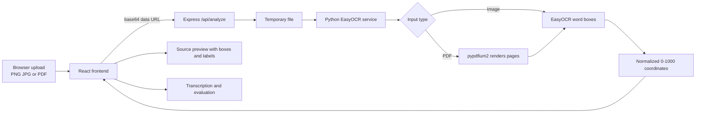
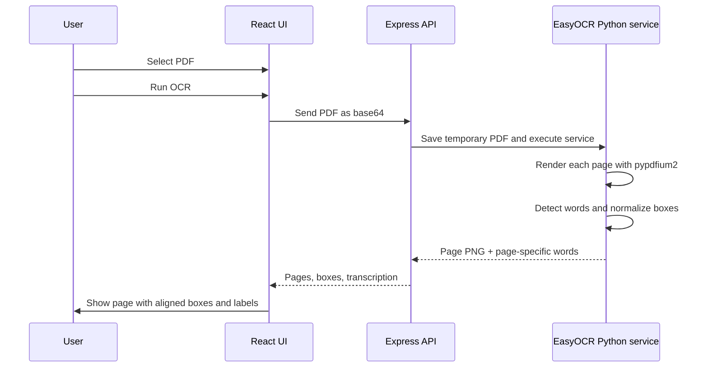

# LeetCode OCR Engine & Technical Interviewer

A local web application for turning handwritten or printed code into a visual OCR review. Upload a PNG/JPG image or a PDF, run EasyOCR locally, inspect word-level bounding boxes, and view the extracted code in an interview-style evaluation panel.

This is an OCR and review prototype, not a full LeetCode compiler or automated judge.

## Features

- Upload PNG, JPG, and PDF code submissions.
- Run OCR locally with Python EasyOCR.
- Draw normalized bounding boxes around recognized words.
- Display the recognized word directly above each box.
- Render PDF pages into images so boxes align with the visible source page.
- Navigate between pages in multi-page PDFs.
- View the extracted transcription and lightweight review feedback.
- Use included sample submissions without uploading a file.
- Keep uploaded files and OCR processing local to the running machine.

## Visual Overview

The application has a React interface, an Express bridge, and a Python OCR service:



For PDFs, the page image and its OCR boxes are returned together. This keeps the overlay coordinate system attached to the exact visible page:



## What the app does

1. The browser reads an uploaded image or PDF as a base64 data URL.
2. Express writes the upload to a temporary file.
3. `python/easyocr_service.py` runs EasyOCR on the file.
4. PDF pages are rendered to PNG using `pypdfium2` before OCR.
5. Each OCR box is converted to normalized `[ymin, xmin, ymax, xmax]` coordinates on a 0–1000 grid.
6. The API returns recognized words, transcription text, and rendered PDF page previews.
7. React draws the boxes over the exact source image and places the recognized word above each box.
8. The review panel shows the transcription and lightweight interview feedback.

## Screenshots and visual documentation

The most useful project screenshot is the analyzed submission view: the handwritten page in the center, blue bounding boxes around detected words, and the recognized labels above the boxes. For a polished GitHub page, capture these views from `http://localhost:3000` and save them under `docs/screenshots/`:

```text
docs/screenshots/
├── image-analysis.png       # PNG/JPG with OCR boxes
├── pdf-analysis.png         # PDF page with aligned OCR boxes
└── multipage-pdf.png        # PDF page navigation
```

Then add them to this section with standard Markdown:

```markdown

```

The Mermaid diagrams above are included so the repository still has useful visual documentation even before screenshots are added.

## Included examples

The app includes preloaded examples such as:

- Reverse Linked List
- Valid Parentheses

Each example demonstrates the source view, OCR boxes, transcription, and evaluation panel.

## Technology

- React 19, TypeScript, and Vite
- Node.js and Express
- Python EasyOCR 1.7.2
- Pillow for image dimensions
- pypdfium2 4.30.0 for PDF page rendering
- PyTorch 2.9.0 and torchvision 0.24.0
- Tailwind CSS and Lucide icons

## Project structure

```text
.
├── python/
│   ├── easyocr_service.py  # Image/PDF rendering and EasyOCR entrypoint
│   └── requirements.txt    # Python OCR dependencies
├── src/
│   ├── App.tsx             # Upload UI, preview canvas, overlays, evaluation
│   ├── index.css           # Application styles
│   ├── main.tsx            # React entrypoint
│   └── samples.ts          # Included examples and OCR data
├── .env.example            # Safe local configuration template
├── package.json             # Node scripts and dependencies
├── server.ts               # Express API and Python process bridge
├── tsconfig.json
├── vite.config.ts
└── README.md
```

## Setup

### Prerequisites

- Node.js 18 or newer
- Python 3.9 or newer
- npm
- Git

### Install Node dependencies

```bash
npm install
```

### Install Python dependencies

Using a virtual environment is recommended:

Windows PowerShell:

```powershell
python -m venv .venv
.venv\Scripts\Activate.ps1
python -m pip install -r python\requirements.txt
```

macOS/Linux:

```bash
python3 -m venv .venv
source .venv/bin/activate
python -m pip install -r python/requirements.txt
```

### Configure Python

Copy the local configuration template:

```powershell
Copy-Item .env.example .env
```

Set `EASYOCR_PYTHON` to the Python interpreter that has EasyOCR installed. For example:

```env
EASYOCR_PYTHON="C:\path\to\python.exe"
```

On systems where `python` is already on PATH, use:

```env
EASYOCR_PYTHON="python"
```

Do not commit `.env`. The repository template must contain placeholders only.

## Run the app

```bash
npm run dev
```

Open [http://localhost:3000](http://localhost:3000), upload a code image or PDF, and select **Run OCR & Technical Interview**.

Useful validation commands:

```bash
npm run build
npm run lint
```

## API behavior

`POST /api/analyze` accepts JSON containing an image or PDF data URL. The response includes:

```json
{
  "words": [{ "text": "return", "box": [480, 310, 515, 395] }],
  "pages": [{
    "image": "data:image/png;base64,...",
    "words": [{ "text": "return", "box": [480, 310, 515, 395] }]
  }],
  "transcription": "return prev",
  "evaluation": {}
}
```

`pages` is populated for PDFs and is used by the UI to keep every page's boxes aligned. Image uploads use the original image as the preview.

## Troubleshooting

### `spawn python ENOENT`

Node cannot find the Python executable. Set `EASYOCR_PYTHON` in `.env` to the full path of the interpreter where EasyOCR was installed.

### `EasyOCR is not installed`

Install the Python dependencies with:

```bash
python -m pip install -r python/requirements.txt
```

### `pypdfium2 is not installed`

Install the same requirements file. PDFs need `pypdfium2` to render pages before OCR.

### `EADDRINUSE: address already in use :::3000`

Another process is using port 3000. Stop the old development server or run the app on another port:

PowerShell:

```powershell
$env:PORT=3001
npm run dev
```

### OCR is slow on the first run

EasyOCR downloads its model weights the first time it starts. Later runs use the cached model. CPU processing is slower than GPU processing.

### Boxes are inaccurate

Use a clear, well-lit image or a high-resolution scan. The system detects text; it does not correct handwriting or infer missing characters. For PDFs, always analyze the upload so the UI can display the rendered page image used by OCR.

## Security

- Keep real credentials in `.env` only.
- Never commit API keys or tokens.
- Keep `.env.example` sanitized.
- Rotate a credential immediately if it was ever committed or exposed.
- Uploaded files are written to the operating system temporary directory and removed after OCR processing.

## Limitations

- OCR quality depends on handwriting, contrast, resolution, and page layout.
- The current evaluation is a lightweight review heuristic, not code execution.
- PDF pages are rendered for OCR and visual alignment; selectable PDF text is not preserved as source text.
- The project is intended as a local educational prototype, not a production grading service.

## License

This project does not currently include a license file. Add an open-source license before distributing it publicly.
